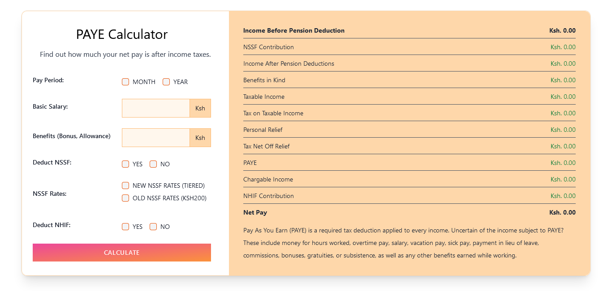

# Kenyan Paye Tax Calculator

calculate paye tax and deductions (params [basic salary, benefits - bonus, allowance])

PAYE
taxable pay - employment income, house and car allowance
-----
Monthly Taxable Pay                     Annual Taxable Pay                      Income Tax Band
Up to KSh12,298                          Up to KSh147,580                       10%
KSh12,299 - KSh23,885                   KSh147,581 - KSh286,623                 15%
KSh23,886 - KSh35,472                   KSh286,624 - KSh425,666                 20%
KSh35,473 - KSh47,059                   KSh425,667 - KSh564,709                 25%
Above KSh47,059                         Above KSh564,709                        30%
Personal Relief: Ksh2,400 Per Month     Personal Relief: Ksh28,800 Per Year

NHIF Calculations
age 18 years and monthly income of > 1000; based on gross income
------------------
Salary Contribution
Ksh5,999 Ksh150
Ksh6,000 – 7,999 Ksh300
Ksh8,000 – 11,999 Ksh400
Ksh12,000 – 14,999 Ksh500
Ksh15,000 – 19,999 Ksh600
Ksh20,000 – 24,999 Ksh750
Ksh25,000 – 29,999 Ksh850
Ksh30,000 – 34,999 Ksh900
Ksh35,000 – 39,999 Ksh950
Ksh40,000 – 44,999 Ksh1,000
Ksh45,000 – 49,999 Ksh1,100
Ksh50,000 – 59,999 Ksh1,200
Ksh60,000 – 69,999 Ksh1,300
Ksh70,000 – 79,999 Ksh1,400
Ksh80,000 – 89,999 Ksh1,500
Ksh90,000 – 99,999 Ksh1,600
Ksh100,000 & Above Ksh1,700
Self-Employed Ksh500

NSSF Pension contribution
--------------------------
Upper earning limit of Ksh18,000
Lower earning limit of Ksh6,000
 The pension contribution is 12% of the pensionable wages made up of two equal portions of 6% from the employee and 6% from the employer subject to an upper limit of Ksh2,160 for employees earning above Ksh18,000. The employee contribution shall be drawn directly from his salary and wages while the employer's contribution shall come directly from the employer. NB: Old NSSF rates are 200 KSH Flat rate.

 Description section
 fully validated

Deliverables(Project objectives)
---------------------------------
A GitHub repository. 💯
A dynamic website that takes in BASIC SALARY and BENEFITS (BONUS, ALLOWANCE)
and calculates the PAYE and Net Pay of the users based on the kenyan income tax bands
provided.
A hosted website on github pages should be submitted on google classroom